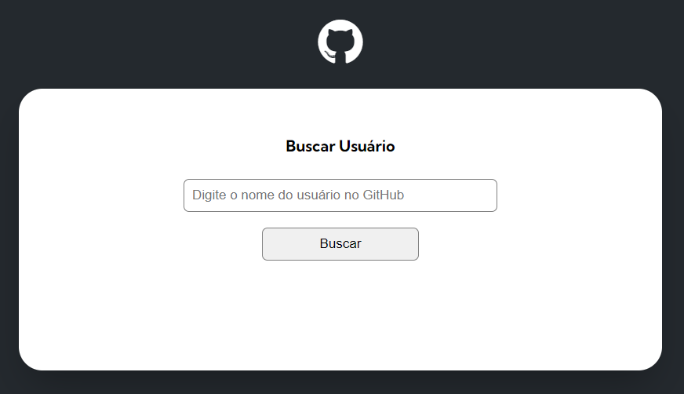
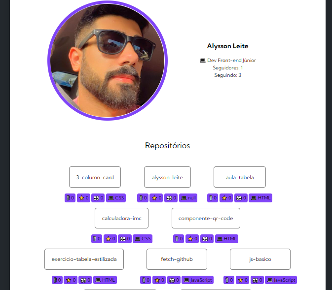

# Projeto API Github com Fetch

> Projeto que consumiu a API do Github usando o Fetch para exibir na tela estatísticas do usuário, como foto, bio, seguidores, repositórios e eventos.

> Este projeto foi um desafio do curso Devquest de Front-end do Dev em Dobro.

## Índice

- [Imagem do projeto](#imagem-do-projeto)
- [Funcionalidades](#funcionalidades-🔨)
- [Tecnologias](#tecnologias-💻)
- [O que aprendi](#o-que-aprendi-📘)
- [Contato](#contato)

## Imagem do Projeto

## Funcionalidades 🔨

*Dados do usuário pesquisado*

- Foto de perfil
- Bio
- Seguidores e seguindo
- Repositórios
    - Fork
    - Estrelas
    - Visualizações
    - Linguagem do projeto
- Eventos
    - Nome do repositório
    - Mensagem do evento (seja de pushevent ou createevent)

## Tecnologias 💻

- HTML
- CSS
- Javascript
- Github
- API

## O que aprendi 📘

Neste projeto, aprendi a consumir uma API utlizando o Fetch. No caso, utilizei a API do Github para localizar dados de usuários.

Aperfeiçoei conhecimentos de javascript, como exportação e importação, async e await, template strings, eventos, entre outros.

## Contato

📩 alysson_leite@yahoo.com.br

🔗 [Linkedin](https://www.linkedin.com/in/alysson-leite-14040a239/)